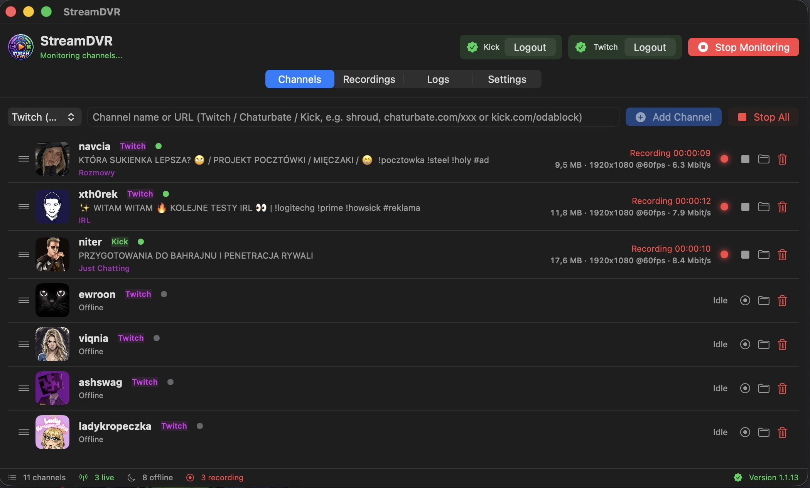

# StreamDVR

Native **macOS** (Swift/AppKit) and **Windows** (WPF/.NET) apps for recording live
streams at maximum quality. Supports **Twitch**, **Chaturbate** and **Kick**, and
automatically starts recording when a tracked channel goes live.



## Features

### Channel management

- **Three platforms** — add a channel by name, or paste a URL:
  - `https://www.twitch.tv/nick`
  - `https://kick.com/nick`
  - `https://chaturbate.com/channel name/` (incl. locale subdomains like `pl.`)
- **Platform picker** — choose the default platform (Twitch / Chaturbate / Kick)
  when adding a plain channel name; full URLs always win
- **Drag to reorder** channels (macOS + Windows)
- **Per-channel folder button** — jump straight to a channel's recordings
  (macOS: Finder, Windows: Explorer)
- **Auto sort — live channels to the top** — manual order is kept and restored
  when disabled

### Status monitoring

- **Configurable status-check interval** — check your channels every 15 / 30 / 60 /
  120 seconds (default 60 s), changeable in Settings
- **Live status, title & game** are refreshed automatically while the app is open
- **Status bar** — channels / live / offline / recording counters, plus the current
  app version with a green "up to date" checkmark

### Recording

- **Automatic recording** — starts as soon as a tracked channel goes live, stops
  when the stream ends
- **Maximum quality** — always the best available stream (`best`)
- **Ad-free** recordings on Twitch via streamlink `--twitch-disable-ads`
- **Descriptive filenames** — `YYYY-MM-DD_StreamTitle_HH-MM-SS.ts`
- **Clean folder structure** — `StreamDVR/<platform>/<login>/`, one subfolder per
  channel
- **Live recording stats** — file size, resolution with FPS (e.g. `1920x1080 @60fps`)
  and current bitrate
- **Prevent Mac sleep** while monitoring (native macOS power assertion, no extra
  permissions)
- **Choose output folder** — changeable in Settings, openable in Finder/Explorer

### Accounts & login

- **Twitch login** — built-in browser window captures your session; premium/Prime
  users get ad-free recordings automatically
- **Kick login** — optional; forwards your session cookies to streamlink
- **Logout buttons** for both accounts

### Automatic updates

- **Built-in updater** — checks GitHub Releases for the newest macOS/Windows build
- **One-click update** — "Update available" button in the status bar downloads,
  installs and restarts the app
- **Check for updates on launch** toggle + manual "Check now" button in Settings
- Version displayed in the status bar (green checkmark when up to date)

### Automatic dependency installation

On first launch the app checks for the tools it needs and installs anything missing:

- **Homebrew** — if not installed, the official Homebrew installer runs automatically
- **streamlink** — installed via `brew install streamlink` (required for recording)
- **ffmpeg / ffprobe** — installed via `brew install ffmpeg` (resolution/FPS/bitrate stats)

If an installation fails (e.g. because admin privileges are required), the app shows a
clear "missing component" message with manual install instructions and waits for a
relaunch. Installations run in the background — a small "Installing dependencies…"
spinner appears in the status bar.

> Docker-friendly note: `streamlink`, `ffprobe` and Homebrew are detected on PATH and
> in the standard `/opt/homebrew` / `/usr/local` locations.

## macOS build

```bash
./build.sh          # bumps version, builds to build/StreamDVR.app, commits + pushes
open build/StreamDVR.app
```

- Requires macOS 13+, Xcode Command Line Tools. `streamlink`/`ffprobe` are optional —
  the app installs them (and Homebrew) automatically on first launch.
- `build.sh` reads/writes `build_version.txt` so the app version increments on each
  build (patch limited to 15, then minor bumps: `1.0.15 → 1.1.0`).
- IDs: bundle identifier `com.streamdvr.app`, app name `StreamDVR`.

## Windows build

```bash
export DOTNET_ROOT="$HOME/.dotnet"; export PATH="$DOTNET_ROOT:$PATH"   # if not on PATH
dotnet build Windows/TwitchDVR.App/TwitchDVR.App.csproj -c Release     # quick build
cd Windows
powershell -ExecutionPolicy Bypass -File .\build.ps1                   # auto-version + single-file exe + zip
```

- Requires .NET SDK 8.0+ and WebView2 Runtime.
- `build.ps1` bumps the PATCH version (`Windows/version.txt`), publishes a
  self-contained single-file `StreamDVR.exe` and zips it as
  `StreamDVR-Windows-v<version>.zip`.
- On first launch the Windows app auto-installs missing `streamlink` / `ffmpeg` via
  `winget`.
- See `Windows/README.md` for details.

## Releases

Both platforms share one GitHub repository (`kamil004/StreamDVR`), but version
numbers are **independent**:

| Platform | Version | Release asset prefix |
|----------|---------|----------------------|
| macOS    | `1.1.x` | `StreamDVR-macOS-v*.zip` |
| Windows  | `1.0.x` | `StreamDVR-Windows-v*.zip` |

Each app's updater only looks at its own asset prefix, so releasing one platform
never triggers updates on the other.

## Platform notes

| Platform    | Status check                                   | Recording                                    |
|-------------|------------------------------------------------|----------------------------------------------|
| Twitch      | GraphQL (gql.twitch.tv)                        | streamlink `--twitch-disable-ads`            |
| Chaturbate  | Room HTML — HLS playlist (`m3u8`) present?     | streamlink on the extracted `m3u8` URL       |
| Kick        | `kick.com/api/v2/channels/<slug>`              | streamlink built-in `kick` plugin            |

## Recording behavior

- **Location** — `~/Documents/StreamDVR/<platform>/<login>/` (macOS) or
  `%USERPROFILE%\Documents\StreamDVR\<platform>\<login>\` (Windows), changeable in Settings.
- **Auto-start** — polled at the configured interval while monitoring; recording starts when live.
- **Auto-stop** — file is finalized when the stream ends or you press Stop.
- **Ads** — recordings never contain advertisements (Twitch) thanks to streamlink.

## Settings storage

- **macOS** — `~/Library/Application Support/TwitchDVR/settings.plist`
  (keys: `channels`, `twitch_output_dir`, `auto_sort_live`, `prevent_sleep`,
  `check_updates`, `poll_interval`, …)
- **Windows** — `%APPDATA%\StreamDVR\settings.json`

## License

For personal use only. Respect each platform's Terms of Service and streamers' copyright.